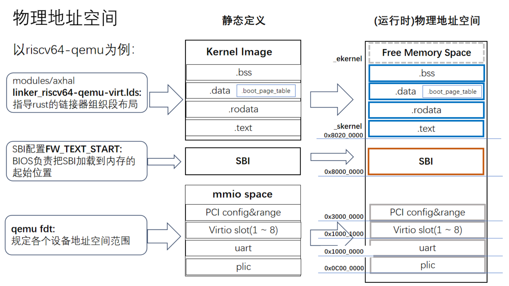
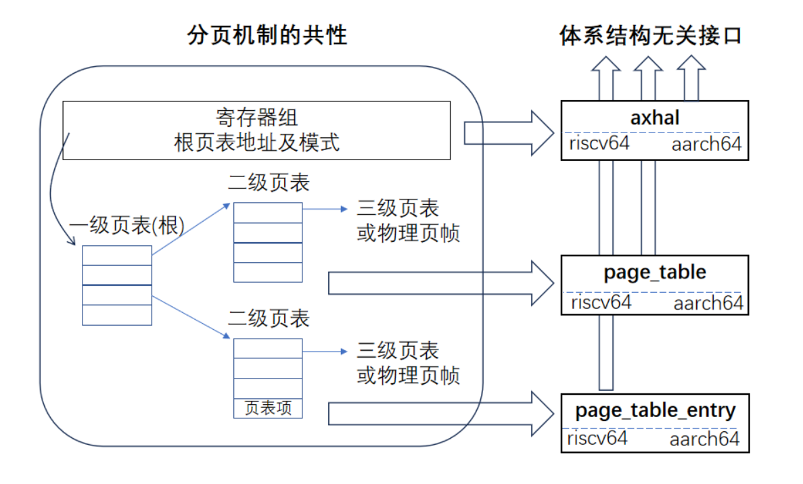
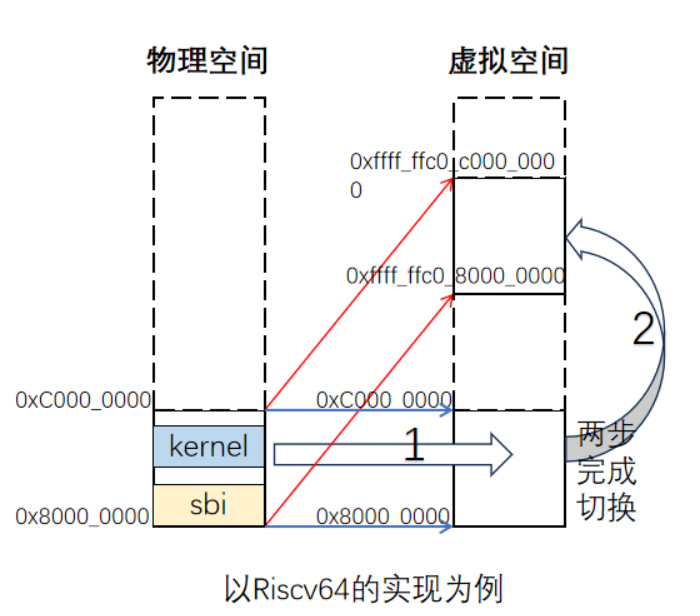
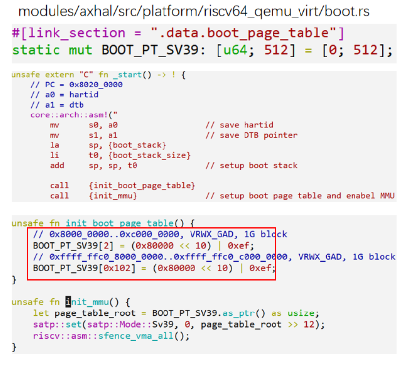
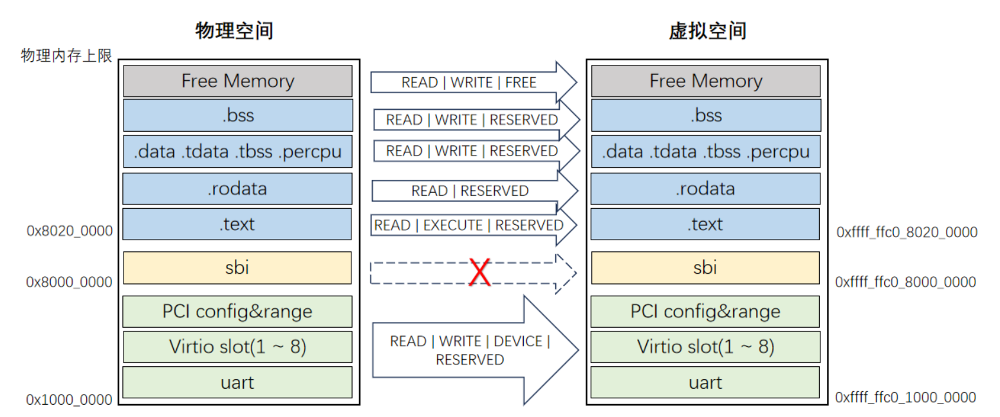
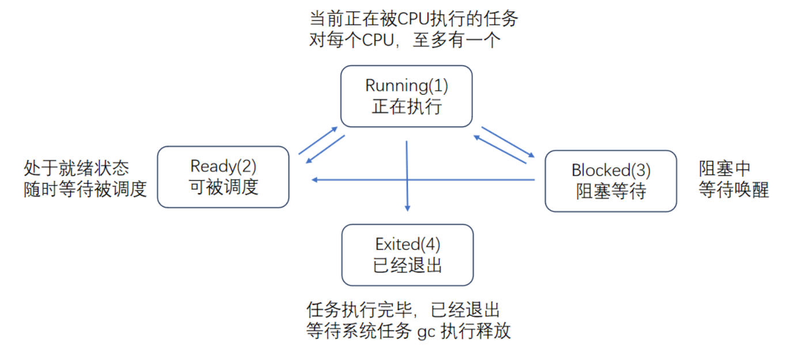
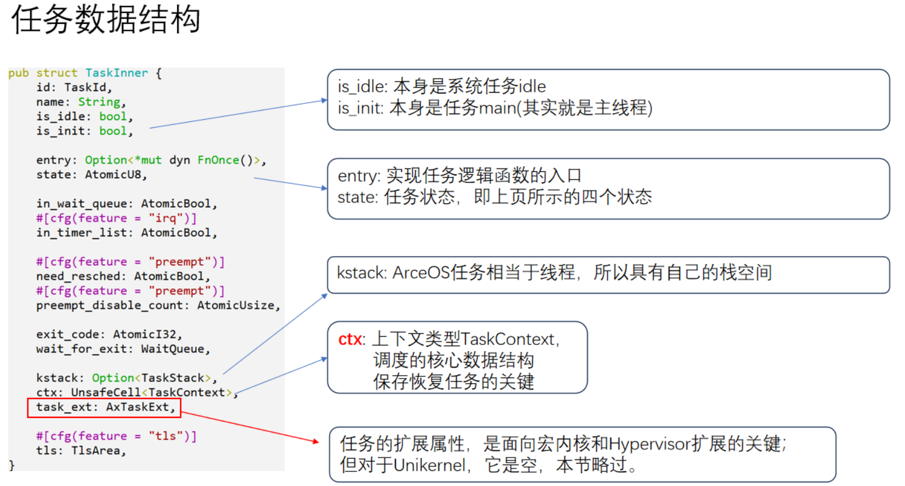
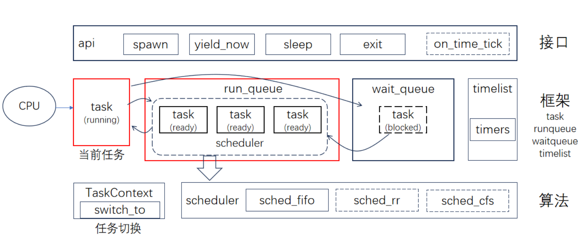
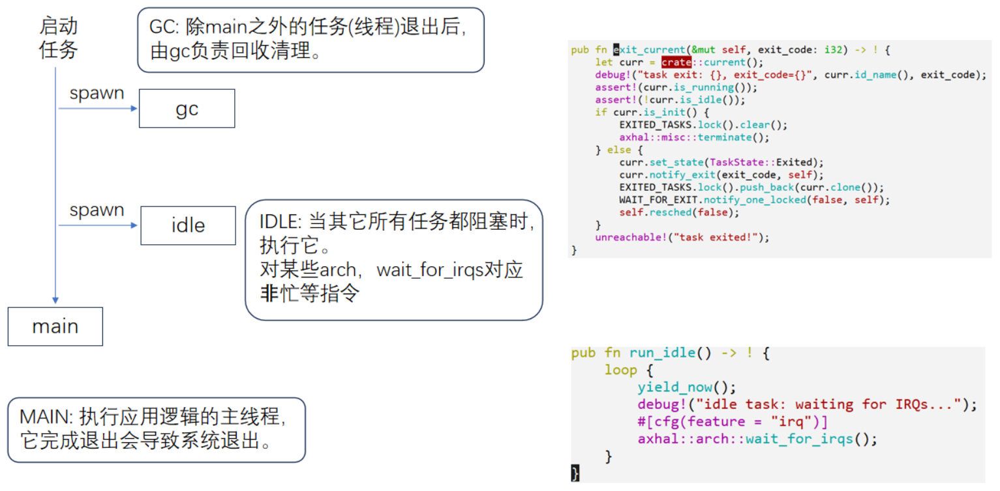
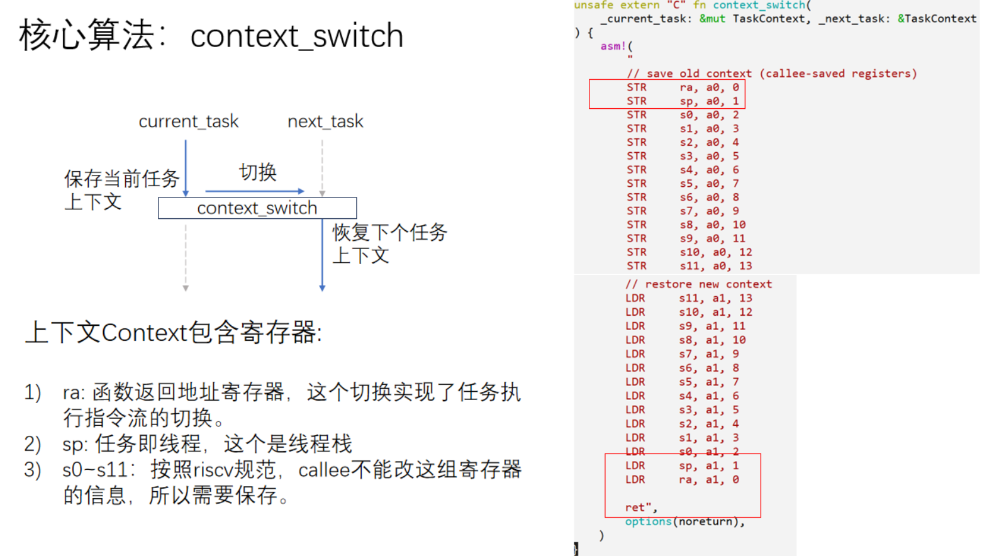

# Unikernel地址空间与分页、多任务支持（协作式）

+ Unikernel的物理地址空间布局: 
  
  

  可以看出 qemu_fdt 规定的各个设备地址空间范围实际上是在低地址空间，并从 `0x8000_0000` 开始存放 SBI 以及内核代码，因此实际上在启用 `paging` feature之前，是无法访问到 qemu_fdt 这部分地址空间的

+ 分页机制对应的组件
  
  

+ 分页第一阶段——早期启用（必须）
  
  
  
  **目标**：完成Paging切换后，建立从虚拟空间0xffff_ffc0_8000_0000 ~ 0xffff_ffc0_8000_0000到物理空间0x8000_0000~0xC000_0000 的映射，范围1G

  具体实现：
    1. 恒等映射保证虚拟空间与物理空间有一个相等范围的地址空间映射(0x80000000~0xC0000000)。切换前后地址范围不变，但地址空间已经从物理空间切换到虚拟空间。

    2. 给指令指针寄存器pc，栈寄存器sp等加偏移，在图中该偏移是0xffff_ffc0_0000_0000。如此在虚拟空间执行平移后，就完成到最终目标地址的映射
   
  代码示例：

  

  可以看出实际上这段1G内存的映射只用到了一级页表，实际上这是一个大页映射，可以看出页表项的标志位被设置为 `0xef` 对应 `DAG_XWRV`，`XWR` 这三个标记就已经表示这是一个叶子页表项，因此直接返回对应的物理页帧，不再向下探索二、三级页表

+ 分页阶段2——重建映射（可选）

  
  
  指定paging feature的情况下，启动后期重建完整的空间映射，因此paging不是决定分页是否启用，而是决定是否包含阶段2，那么为什么需要重建映射？

  1. 管理更大范围的地址空间，包括设备的MMIO范围
  2. 分类和权限的细粒度控制
   

+ acreos 的任务与任务状态
  
  

  

+ 通用调度框架
  
  

  主要的调度 API：
  
  1. `spawn&spawn_raw`：产生一个新任务，加入runqueue，处于Ready
  2. `yield_now`：主动让出CPU执行权
  3. `sleep&sleep_until`：睡眠固定的时间后醒来，在timers定时器列表中注册，等待唤醒
  4. `exit`：当前任务退出，标记状态，等待GC回收
   
+ 系统默认内置任务
  
  

  在多CPU上，每个CPU都会有这三个默认任务，GC线程每次都会在一个线程推出之后被唤醒

+ 任务切换
  
  