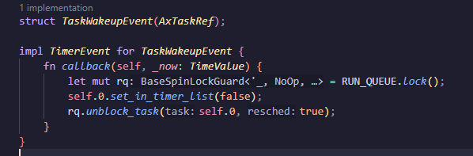
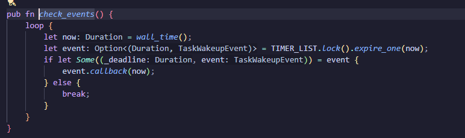
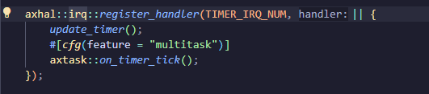
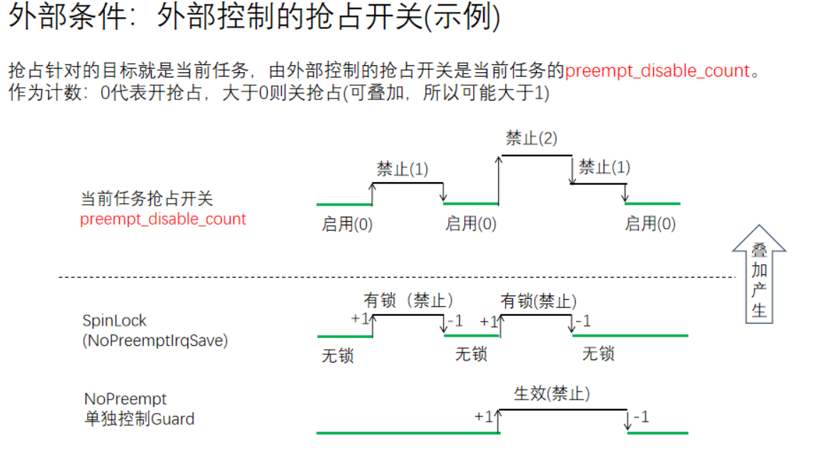
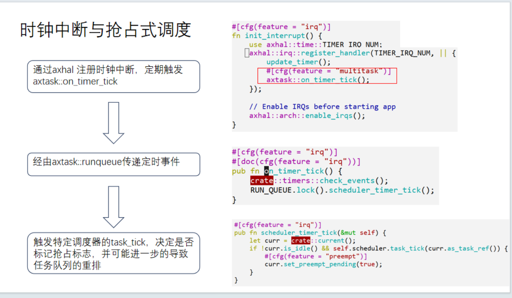
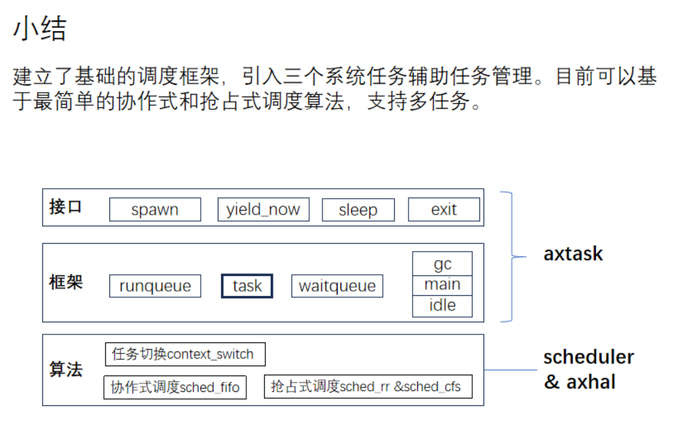
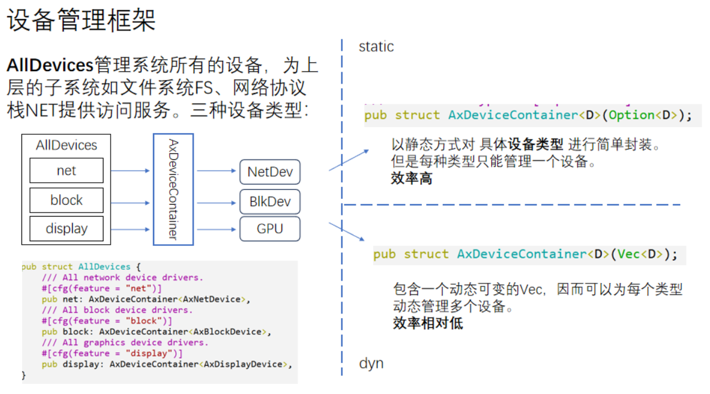
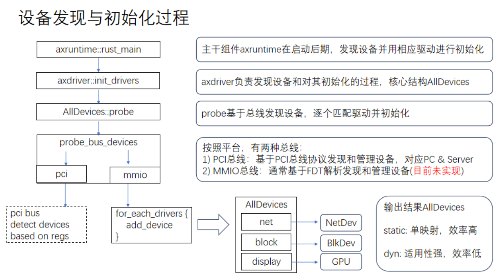
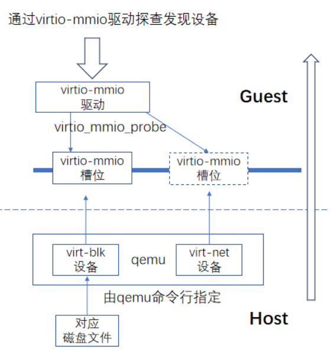
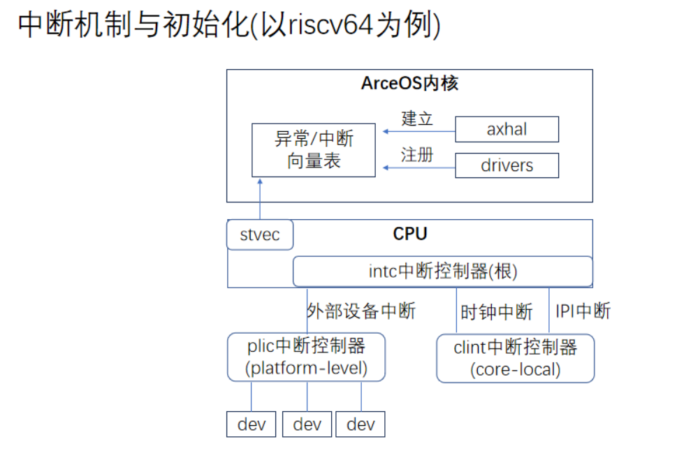

# Unikernel 抢占式调度、磁盘块设备的读取

+ 抢占式调度
  
  调度器依据特定的策略可以打断当前任务的执行，移交CPU的执行权给当前“更”有资格的任务，抢占机制的根本保障是系统定时器，所以抢占针对的主要操作目标就是current task当前任务

  抢占式调度的核心组件为timer，timer组件包括有一个timerlist类，是核心，timerlist本质是一个最小堆，按照唤醒时间进行排序，每次会从timerlist取出唤醒时间最近的事件，然后与当前时间进行比较，如果当前时间大于等于该值，会执行与该时间绑定的回调函数，对于多任务而言，该回调函数就是把当前任务重新加入到run_queue中，

  

  check_events函数会在每次循环时检查当前timerlist已经到达截止时间的事件并调用对应的回调函数

  

  如何确保check_events函数会在每个时钟中断时被调用？这是由axhal组件通过在对应平台中注册一个回调函数实现的

  

  timer_irq_num是对应平台时钟中断对应的异常值，时钟中断是抢占式调度的基础，axsync组件依赖 axtask 模块提供的调度功能 Cargo.lock:599-604 ，特别是 WaitQueue 机制来管理等待的任务

  抢占式调度并非无条件的抢占，要两个条件都具备：一是任务内部达到了某种条件，例如时间片耗尽；二是外部条件与时机，在preempt从disable到enable的那个状态切换点触发抢占

  

+ 时钟中断与抢占式调度
  
  

  arceos 中实现了两种调度算法，一个是Round_Robin机制，在协作式调度FIFO的基础上，由定时器定时递减当前任务的时间片，耗尽时允许调度，一旦外部条件符合，边沿触发抢占，当前任务排到队尾，如此完成各个任务的循环排列，注意到并非在当前进程被设置为可抢占时，就立刻调度下一个任务，这个操作是由axhal注册的另一个中断函数去执行的，使用了太多rust的高级特性，比较难懂

  另一种是CFS算法，一种根据优先级进行调度的算法

  

+ 设备管理
  
  AllDevices管理系统所有的设备，为上层的子系统如文件系统FS、网络协议栈NET提供访问服务。三种设备类型：

  

+ 设备发现和初始化
  
  

  以virtio设备为例子：

  1. qemu模拟器基于命令行产生设备 `-device virtio-blk-device,drive=disk0 -drive id=disk0,format=raw,file=disk.img`
  2. qemu将设备mmio地址区域映射到Guest中，qemu-virt平台默认有8个区域槽位，通常只有部分会形成映射，其它处于未映射状态，即表现为空设备
  3. virtio-mmio驱动逐个发请求区探查3这些区域槽位，对应映射设备响应请求，返回本设备的类型ID；没有映射的槽位返回零，表示空设备
  4. virtio-mmio驱动把probe结果报告上层
   
  

+ virtio驱动和virtio设备交互的两条路：
  1. 主要基于vring环形队列:本质上是连续的Page页面，在Guest和Host都可见可写
  2. 中断响应的通道：主要对等待读取大块数据时是有用。
  
  